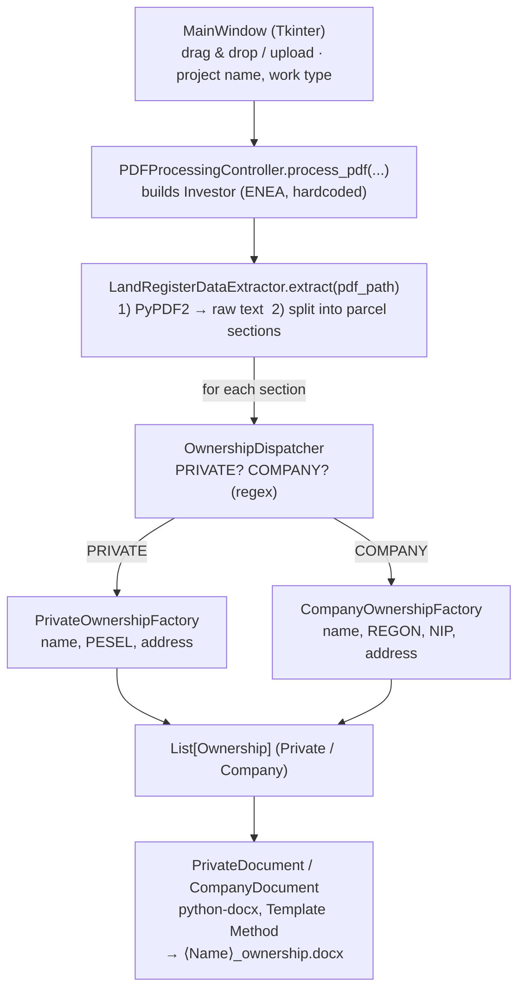

# 📄 PDF Data Extractor

> A desktop automation tool that turns **Polish land-registry PDFs** (*Wypis z rejestru gruntów* /
> *księga wieczysta*) into ready-to-sign **Word declarations** (*oświadczenia*) for a power-grid
> operator's easement (*służebność przesyłu*) process. Drop in the PDFs, and it emits one pre-filled
> `.docx` declaration per owner into a folder you choose.

<p>
  
  
  
  
  
  
</p>

> ℹ️ **Language note:** the GUI, generated declarations and the document layout are in **Polish**;
> the codebase is in English.

---

## Table of Contents

1. [Purpose](#-purpose)
2. [Main Features](#-main-features)
3. [Tech Stack](#-tech-stack)
4. [Architecture](#-architecture)
5. [Workflow](#-workflow)
6. [Quickstart](#-quickstart)
7. [Repository Layout](#-repository-layout)
8. [Known Limitations](#-known-limitations)

---

## 🎯 Purpose

When an electricity distribution operator (here: **ENEA Operator sp. z o.o.**) plans to build or
modernise power infrastructure, it must obtain a signed consent declaration from **every** land owner
whose parcel the line crosses. The source data lives in official land-registry extracts (PDF), often
**hundreds of parcels per document**, mixing:

- **private owners** (individuals identified by *PESEL* — the Polish national ID, referred to as "SSN"
  in the code), and
- **institutional owners** (companies / municipalities identified by *REGON* and *NIP* — the Polish
  business & tax numbers).

Doing this by hand — reading each entry, copying the name/ID/address/parcel/land-register number into
a Word template — is slow and error-prone. **PDF Data Extractor automates the whole pipeline:** it
reads the PDFs and emits one pre-filled `.docx` declaration per owner.

This is not a generic "PDF reader" — it is a **domain-specific document-automation tool** built around
one real administrative workflow. It is specialised to Polish land registers and produces **`.docx`**
(Word) files.

---

## ✨ Main Features

| Feature | Details |
|---|---|
| **Batch PDF intake** | Add many land-registry PDFs at once via **drag-and-drop** or a file dialog (`tkinterdnd2`). |
| **Section splitting** | Splits raw PDF text into per-parcel sections using a registry-specific anchor regex (`nazwa organu wydającego dokument … Strona X z Y`). |
| **Owner-type detection** | Classifies each section as **PRIVATE** (individual) or **COMPANY** (institution) from the text, via a dispatcher. |
| **Field extraction** | Pulls owner name, **PESEL**, address / company name, **REGON**, **NIP**, plus registration unit, cadastral circle (*obręb*), parcel number, and land-register (KW) number. |
| **Declaration generation** | Builds a formatted Word `.docx` legal declaration per owner (headers, bold/italic runs, bullet lists, signature block) via `python-docx`. |
| **Batch output** | Auto-saves `⟨OwnerName⟩_ownership.docx` for every owner into a user-selected directory; filenames are sanitised. |
| **Structured logging** | Full DEBUG/INFO/WARNING/ERROR trail to `logs/pdf_processor.log` and the console, via a configurable `LoggerFactory`. |
| **Resilient processing** | Per-section `try/except`: a malformed entry is logged and skipped, and the run continues (a real run processed **124** ownership records from one file). |
| **Standalone distribution** | Packaged to a Windows executable (`PeDeFer.exe`) with **PyInstaller**, so end users run it without a Python install. |

---

## 🧰 Tech Stack

| Layer | Technology |
|---|---|
| **Language** | Python **3.12** (also executed under 3.11 — see `__pycache__`) |
| **GUI** | `tkinter` (stdlib) + **`tkinterdnd2`** for drag-and-drop |
| **PDF reading** | **`PyPDF2` 3.0.1** (`PdfReader` / `page.extract_text()`) |
| **Word generation** | **`python-docx`** (`from docx import Document`, `docx.enum.text`) |
| **Pattern matching** | `re` (standard library), centralised in `RegexPatterns` |
| **Logging** | `logging` (stdlib), wrapped by a `LoggerFactory` |
| **Packaging** | **PyInstaller** → `build/PeDeFer/…`, target `dist/PeDeFer.exe` |
| **Tooling / IDE** | PyCharm/IntelliJ (`.idea`), **Black** formatter, **JetBrains Qodana** config (`qodana.yaml`) |

> ⚠️ **Dependency caveats:**
> - `requirements.txt` pins **`docx~=0.2.4`**, which is a *different, abandoned* PyPI package — **not**
>   the `python-docx` the code actually imports. Installing per the file will break the app.
> - **`reportlab`** is listed in `requirements.txt` but is **not used** anywhere in the code (leftover
>   from an earlier PDF-generation idea).
> - **`PyPDF2`** is deprecated upstream (superseded by `pypdf`). `app/file_utils/pdf_utilities.py` still
>   uses the removed 1.x API (`PdfFileReader`, `getNumPages`) and would fail under the pinned 3.0.1 — it
>   is dead code.

---

## 🏛 Architecture

Layered, **MVC-flavoured** design with clear separation of concerns and manual **dependency
injection** wired up in `app/main.py`.

```
app/
├── main.py                     # composition root: builds & injects all components
├── view/
│   └── main_window.py          # Tkinter GUI, drag & drop, input validation
├── controller/
│   └── PDFProcessingController.py   # orchestrates extract → generate
├── data_extractor/             # ── extraction pipeline ──
│   ├── data_extractor_interface.py      # IDataExtractor (ABC)
│   ├── land_register_data_extractor.py  # read PDF, split sections
│   ├── ownership_factory/
│   │   ├── ownership_factory.py         # OwnershipFactory (ABC, shared field finders)
│   │   ├── private_ownership_factory.py # individuals (PESEL)
│   │   ├── company_ownership_factory.py # companies (REGON/NIP)
│   │   └── ownership_dispatcher.py      # Strategy: choose factory by content
│   ├── regex/
│   │   ├── RegexPatterns.py             # centralised pattern constants
│   │   └── RegexUtils.py                # reusable match helpers
│   └── exceptions/
│       └── InvalidOwnershipTypeException.py
├── document_generator/         # ── Word output ──
│   ├── document_interface.py            # IDocument (ABC, Template Method: generate())
│   ├── private_document.py              # individual declaration layout
│   ├── company_document.py              # company declaration layout
│   ├── document_generator.py            # (legacy/unused helper)
│   └── text_data.py                     # small formatting value object
├── model/                      # ── domain ──
│   ├── investor.py                      # the grid operator (beneficiary)
│   ├── owner.py                         # a single owner value object
│   └── ownership/
│       ├── ownership.py                 # Ownership (ABC)
│       ├── private_ownership.py         # PRIVATE
│       ├── company_ownership.py         # COMPANY
│       └── ownership_kind.py            # OwnershipKind enum
├── logger/
│   └── logger_factory.py                # configurable logging factory
└── file_utils/                 # (legacy helpers, largely unused)
    ├── file_handler.py
    └── pdf_utilities.py
```

### Design patterns in use

- **Interfaces / Abstract Base Classes** — `IDataExtractor`, `OwnershipFactory`, `Ownership`, `IDocument`.
- **Factory Method** — `PrivateOwnershipFactory` / `CompanyOwnershipFactory`, and `LoggerFactory`.
- **Strategy / Dispatcher** — `OwnershipDispatcher` selects the extraction strategy from the content.
- **Template Method** — `IDocument.generate()` defines the document skeleton; subclasses fill the sections.
- **Dependency Injection** — all collaborators (factories, dispatcher, extractor, controller, logger) are constructor-injected and composed in `main.py`.
- **Centralised constants** — `RegexPatterns` isolates *what* to match from *how* to match (`RegexUtils`).
- **Custom exceptions** — `InvalidOwnershipTypeException` for domain-specific error flow.

---

## 🔄 Workflow



**Step by step**

1. **View** collects the PDF list + project/work inputs and calls the controller per file.
2. **Controller** creates the (currently hardcoded) `Investor` and asks the extractor for the ownership list.
3. **Extractor** reads text (PyPDF2), splits it into per-parcel **sections**, and for each section asks the **Dispatcher** to build the right ownership object(s).
4. **Dispatcher** runs classification regexes and delegates to the **Private** or **Company** factory.
5. **Factories** (subclasses of a shared `OwnershipFactory`) extract the fields via `RegexPatterns` + `RegexUtils` and return domain objects.
6. **Controller** picks the matching **Document** class per ownership kind, generates the `.docx`, and saves it.
7. **Logger** records every step; bad sections are skipped without aborting the batch.

---

## 🚀 Quickstart

### Option A — run from source (developer)

```bash
# 1. Clone / unzip, then from the project root:
python -m venv .venv
# Windows:
.venv\Scripts\activate

# 2. Install the ACTUAL dependencies (not the raw requirements.txt — see caveat above):
pip install PyPDF2==3.0.1 python-docx tkinterdnd2

# 3. Launch as a module from the project root (the code uses absolute `app.*` imports):
python -m app.main
```

> **Why `python -m app.main` and not `python main.py`?**
> Every module imports via absolute paths (`from app.controller… import …`), so the project must be
> launched as a package from the repository root. Note also that `main.py` configures the log
> directory as `../logs` (relative to the current working directory), so the location of the `logs/`
> folder depends on where you launch from.

### Option B — run the packaged app (end user)

Launch the PyInstaller-built **`PeDeFer.exe`** (produced under `dist/`). No Python installation
required.

### Using the app

1. **Drag & drop** (or upload) one or more *Wypis rejestru gruntów* PDFs.
2. Fill **Nazwa projektu** (project name) and **Rodzaj prac** (type of work).
3. Click **Generuj oświadczenia** (Generate declarations) and pick an output folder.
4. Collect the generated `⟨Name⟩_ownership.docx` files.

---

## 📁 Repository Layout

| Path | Purpose |
|---|---|
| `app/` | Application source (see [Architecture](#-architecture)). |
| `logs/` | Runtime log output (**contains real personal data** — should not be committed). |
| `build/` | Committed **PyInstaller** build artifacts for `PeDeFer.exe`. |
| `requirements.txt` | Declared dependencies (has known issues — see caveats). |
| `qodana.yaml` | JetBrains Qodana static-analysis config (linter left as a template placeholder). |
| `.idea/` | PyCharm/IntelliJ project settings. |
| `README.md` | Original project readme. |

---

## ⚠️ Known Limitations

- Tightly coupled to **one exact PDF layout**; no OCR fallback for scanned documents.
- **No automated tests.**
- Business data (**investor = ENEA**, court = *Sąd Rejonowy w Tucholi*) is **hardcoded** into the
  controller and templates.
- Several **latent extraction bugs** (label text leaking into values, wrong parcel number).
- **`logs/` contains real personal data** and build artifacts are committed — both should be excluded
  from version control.
